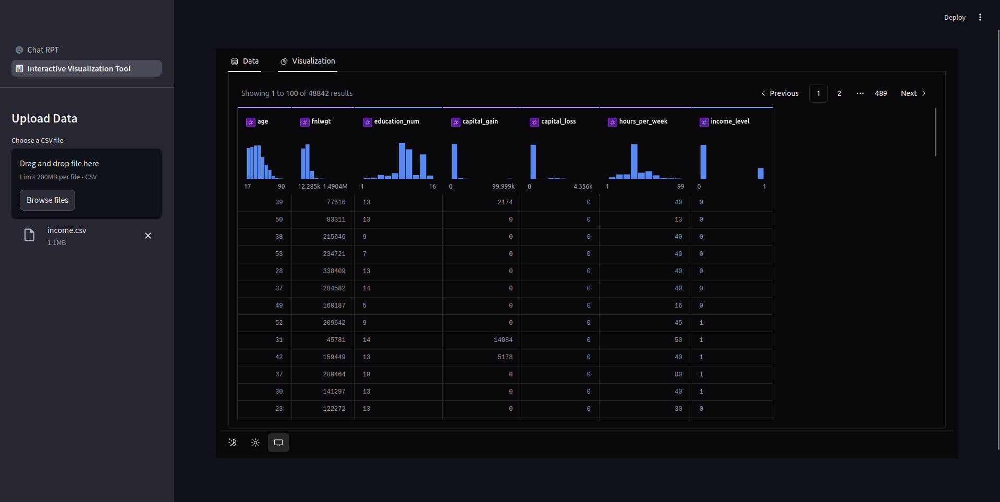

# data_analys_with_llm

This is a mini-project using Large Language Models (LLMs) to analyze data. You can upload a CSV file to chat with the LLM to help you analyze the data.

Furthermore, you interact with the data using pygwalker.

